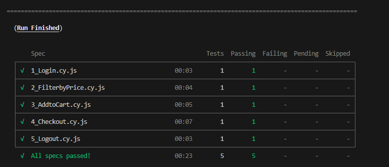

**Pet Circle - Task 1 - Automating saucedemo.com**

**Requirements**
1. Login: Automate the login process on the website https://www.saucedemo.com/
using valid credentials.
2. Filter Products: Write automation scripts to filter products by price from low to high.
3. Add to Cart: Automate adding the first two items from the filtered list to the cart.
4. Checkout Process: Automate the checkout process, including the cart details page
providing shipping details, and completing the purchase.

**Tech stack used**
Cypress, javascript, Node.js (which included npm), VS code

**Summary of my tests**
For the given requirements, I have written small simple tests instead of one big piece of code.
I've also utilised commands.js file to create my own custom commands which I reused in different tests to simplify code.
1_Login.cy.js - Logs in the user with valid credentials as per requirement
2_FilterbyPrice.cy.js - Filters products on the inventory page by price(low to high)
3_AddtoCart.cy.js - Adds the top 2 filtered products to cart 
4_Checkout.cy.js - Initiates the checkout process, asks for checkout details and finishes checkout
5_Logout.js - Logs the user out thus completing the test

**Set Up (on your local)**
1. Clone the repository to your local computer

git clone https://github.com/kk-github2/kk-petcircle-Task-1.git

2. If npm was not a part of  your Node.js install, Use the package manager npm to install dependencies:

npm install

3. If you do not have cypress on your local, install it
npm install cypress --save--dev
A successful installation should give you the cypress version on querying 'npx cypress --version'

4. Open the cloned folder on your VS code and get ready to run the tests.

**Running the tests:**
1. To open Cypress test runner and choose specific tests to run
**npx cypress open > E2E testing > Choose your browser (Chrome in my case) > Click on the specific test file in 'specs'**

2. To run all tests together in Cypress test runner
**npx cypress open > E2E testing > Choose your browser (Chrome in my case) > Choose 'Run 5 specs' in specs**

3. To run all tests in headless mode without test runner
**npx cypress run --spec "cypress/e2e/**/*"  **   

4. To run specific tests only without test runner
**npx cypress run --spec "cypress/e2e/**/*" **

